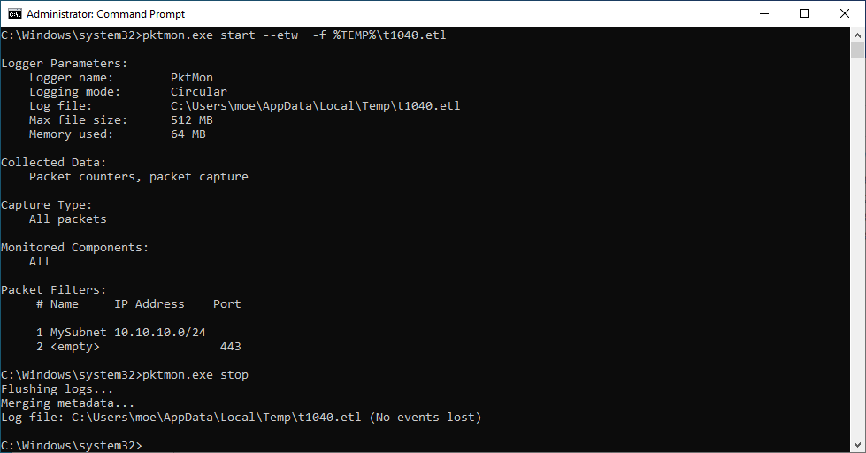

# Network Sniffing

**ATT\&CK ID:** [T1040](https://attack.mitre.org/techniques/T1040/)

**Required Permissions: **<mark style="color:orange;">**Network interface access and packet capture driver**</mark>

**Description**

Adversaries may sniff network traffic to capture information about an environment, including authentication material passed over the network. Network sniffing refers to using the network interface on a system to monitor or capture information sent over a wired or wireless connection. An adversary may place a network interface into promiscuous mode to passively access data in transit over the network, or use span ports to capture a larger amount of data.

Data captured via this technique may include user credentials, especially those sent over an insecure, unencrypted protocol. Techniques for name service resolution poisoning, such as LLMNR/NBT-NS Poisoning and SMB Relay, can also be used to capture credentials to websites, proxies, and internal systems by redirecting traffic to an adversary.

Network sniffing may also reveal configuration details, such as running services, version numbers, and other network characteristics (e.g. IP addresses, hostnames, VLAN IDs) necessary for subsequent Lateral Movement and/or Defense Evasion activities.

## Techniques

### Empire

The `empire` module essentially runs the same command as the `Netsh` binary shown further below on this page.

```
powershell/collection/packet_capture
```

.png>)

After capture has been stopped the `capture.etl` file can be converted to a PCAP with `etl2pcapng` (Windows required).

**Github:** [https://github.com/microsoft/etl2pcapng/releases](https://github.com/microsoft/etl2pcapng/releases)

After converting to PCAP we are able to view the results in Wireshark. Whilst we did not capture any credentials we have discovered `\\Srv01\Share` through SMB analysis.

.png>)

### Metasploit

```bash
# Meterpreter 

use sniffer
sniffer_interfaces
sniffer_start <ID>
sniffer_dump <ID> /tmp/sniff.pcap
sniffer_stop <ID>
sniffer_release <ID>
```

### Netsh

```bash
# Start trace
netsh trace start capture=yes tracefile=C:\Windows\Temp\trace.etl maxsize=10

# Stop trace
netsh trace stop
```


After capture has been stopped the trace`.etl` file can be converted to a PCAP with `etl2pcapng` (Windows required).

**Github:** [https://github.com/microsoft/etl2pcapng/releases](https://github.com/microsoft/etl2pcapng/releases)


### Pktmon

```bash
pktmon.exe start --etw  -f %TEMP%\t1040.etl
TIMEOUT /T 5 >nul 2>&1
pktmon.exe stop

# Filter by port
pktmon.exe filter add -p 445

# Remove filter
pktmon.exe filter remove
```



```
pktmon etl2txt t1040.etl --out t1040.txt
```

Or the .etl file can be opened directly in event viewer.

.png>)
